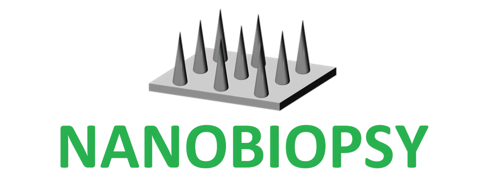

# Nanoneedles Enable Spatiotemporal Lipidomics of Living Tissues

Chenlei Gu1,2*, Davide Alessandro Martella1,2*, Leor Ariel Rose3*, Nadia Rouatbi4, Cong Wang1,2,5, Alaa Zam4, Valeria Caprettini1,2, Magnus Jensen1, Cathleen Hagemann1,6, Andrea Serio1,6, Vincenzo Abbate4, Khuloud Al-Jamal4, Maddy Parsons7, Mads S. Bergholt1, Paul Brennan8, Assaf Zaritsky3, Ciro Chiappini1,2

1. Centre for Craniofacial and Regenerative Biology, King’s College London, SE1 9RT, London, UK.
2. London Centre for Nanotechnology, King’s College London, WC2R 2LS, London, UK.
3. Department of Software and Information Systems Engineering, Ben-Gurion University of the Negev, Be'er Sheva, 8410501 Israel.
4. Institute of Pharmaceutical Sciences, King’s College London, SE1 9NQ, London, UK.
5. Wenzhou eye valley innovation center, Eye Hospital, Wenzhou Medical University, 325027, Zhejiang, China
6. The Francis Crick Institute, NW1 1AT, London, UK.
7. Randall Centre for Cell and Molecular Biophysics, King’s College London, London, UK
8. Translational Neurosurgery, Centre for Clinical Brain Sciences, University of Edinburgh, EH16 4SB, Edinburgh, UK.

*equal author contribution.

## Project setup and run

1. Clone this repository (using git clone <REPO_URL>)
2. Open cmd/shell/terminal and go to project folder: `cd nanoneedle-biopsy`
3. Create a conda environment: `conda env create -f environment.yml`
4. Activate the conda environment `conda activate nanobiopsy`
5. Run `python -m analysis.trianb`
6. Run `python -m analysis.esi_data_analysis`
7. Run `python -m analysis.liver_data_analysis`
8. Run `python -m analysis.drop_deposited_lipids_analysis`
9. Run `python -m analysis.chip_types_data_analysis`
10. Run `python -m analysis.dhg_analysis`
11. Inspect the outputs generated by these scripts in `./nanoneedle-biopsy/analysis/trianb/`, `./nanoneedle-biopsy/analysis/esi/`, `./nanoneedle-biopsy/analysis/liver/`, `./nanoneedle-biopsy/analysis/drop_deposited_lipids/`, `./nanoneedle-biopsy/analysis/chip_types/`, `./nanoneedle-biopsy/analysis/dhg/` respectively

## Repository overview

[Analysis folder](./analysis) - includes the analysis files required to reproduce the results presented in the paper.

[Processing folder](./processing) - includes the general processing code applied to datasets.

[Correlation analysis folder](./correlation) - includes the general correlation analysis code applied to datasets.

[Classification analysis folder](./classification) - contains the general classification analysis code applied to datasets.

## Prerequisite

Before running the codes you should acquire the data (details in the paper). You should create a folder called data next to nanobiopsy folder (not inside it). Each code requires a different dataset as explained bellow. `metadata.csv`  for each folder can be found under the `./metadata/` and should be copied and renamed accordingly.

`./analysis/trianb.py` code requires a folder named `TRIANB` with the following structure:

      .
      ├── data
      │   ├── TRIANB
      │   │   ├── raw
      │   │   │   ├── 20240524_TriANB_Day0_Rep1_Slide_A_Analyte 1_1.ibd
      │   │   │   ├── 20240524_TriANB_Day0_Rep1_Slide_A_Analyte 1_1.imzML
      │   │   │   ├── 20240524_TriANB_Day0_Rep2_Slide_A_Analyte 1_1.ibd
      │   │   │   ├── 20240524_TriANB_Day0_Rep2_Slide_A_Analyte 1_1.imzML
      │   │   │   ├── 20240524_TriANB_Day0_Rep3_Slide_A_Analyte 1_1.ibd
      │   │   │   └── 20240524_TriANB_Day0_Rep3_Slide_A_Analyte 1_1.imzML
      │   │   ├── metadata.csv
      │   │   └── ...
      │   └── ...
      └── nanobiopsy
        
`./analysis/esi_data_analysis.py` code requires a folder named `ESI` with the following structure:

      .
      ├── data
      │   ├── ESI
      │   │   ├── raw
      │   │   │   ├── 201303 BRAIN TISSUE 2_1.mzML
      │   │   │   ├── 201303 BRAIN TISSUE 3-2.mzML
      │   │   │   ├── 201303 NO SCRAPPING REPLICA 1.mzML
      │   │   │   ├── 201303 NO SCRAPPING REPLICA 2.mzML
      │   │   │   └── 201303 NO SCRAPPING REPLICA 3.mzML
      │   │   └── ...
      │   └── ...
      └── nanobiopsy

`./analysis/liver_data_analysis.py` code requires a folder named `LIVER` with the following structure:

      .
      ├── data
      │   ├── LIVER
      │   │   ├── raw
      │   │   │   ├── 220224-optimization-liver-optimised-1 Analyte 1_1.ibd
      │   │   │   ├── 220224-optimization-liver-optimised-1 Analyte 1_1.imzml
      │   │   │   ├── 220224-optimization-liver-standard-1 Analyte 1_1.ibd
      │   │   │   └── 220224-optimization-liver-standard-1 Analyte 1_1.imzml
      │   │   ├── metadata.csv
      │   │   └── ...
      │   └── ...
      └── nanobiopsy

`./analysis/drop_deposited_lipids_analysis.py` code requires a folder named `DROP_DEPOSITED_LIPIDS` with the following structure:

      .
      ├── data
      │   ├── DROP_DEPOSITED_LIPIDS
      │   │   ├── raw
      │   │   │   ├── 210623-pm-0_7 Analyte 1_1.ibd
      │   │   │   └── 210623-pm-0_7 Analyte 1_1.imzML
      │   │   ├── metadata.csv
      │   │   └── ...
      │   └── ...
      └── nanobiopsy

`./analysis/chip_types_data_analysis.py` code requires a folder named `CHIP_TYPES` with the following structure:

      .
      ├── data
      │   ├── CHIP_TYPES
      │   │   ├── raw
      │   │   │   ├── 20240125 4 chips tissue_Slide_A_Analyte 1_1.ibd
      │   │   │   ├── 20240125 4 chips tissue_Slide_A_Analyte 1_1.imzML
      │   │   │   ├── 20240126 4 chips_Porous flat_Slide_A_Analyte 1_1.ibd
      │   │   │   ├── 20240126 4 chips_Porous flat_Slide_A_Analyte 1_1.imzML
      │   │   │   ├── 20240126 4 chips_Porous porous sub_Slide_A_Analyte 1_1.ibd
      │   │   │   ├── 20240126 4 chips_Porous porous sub_Slide_A_Analyte 1_1.imzML
      │   │   │   ├── 20240126 4 chips_Porous_Slide_A_Analyte 1_1.ibd
      │   │   │   ├── 20240126 4 chips_Porous_Slide_A_Analyte 1_1.imzML
      │   │   │   ├── 20240126 4 chips_Solid_Slide_A_Analyte 1_1.ibd
      │   │   │   ├── 20240126 4 chips_Solid_Slide_A_Analyte 1_1.imzML
      │   │   │   ├── 20240128 4chips_porous flat sub_Slide_A_Analyte 1_1.ibd
      │   │   │   ├── 20240128 4chips_porous flat sub_Slide_A_Analyte 1_1.imzML
      │   │   │   ├── 20240128 4chips_porous porous sub_Slide_A_Analyte 1_1.ibd
      │   │   │   ├── 20240128 4chips_porous porous sub_Slide_A_Analyte 1_1.imzML
      │   │   │   ├── 20240128 4chips_porous_Slide_A_Analyte 1_1.ibd
      │   │   │   ├── 20240128 4chips_porous_Slide_A_Analyte 1_1.imzML
      │   │   │   ├── 20240128 4chips_solid_Slide_A_Analyte 1_1.ibd
      │   │   │   ├── 20240128 4chips_solid_Slide_A_Analyte 1_1.imzML
      │   │   │   ├── 20240128 4chips_tissue_Slide_A_Analyte 1_1.ibd
      │   │   │   ├── 20240128 4chips_tissue_Slide_A_Analyte 1_1.imzML
      │   │   │   ├── 20240202 4chips_porous flat_Slide_A_Analyte 1_1.ibd
      │   │   │   ├── 20240202 4chips_porous flat_Slide_A_Analyte 1_1.imzML
      │   │   │   ├── 20240202 4chips_porous nNs porous sub_Slide_A_Analyte 1_1.ibd
      │   │   │   ├── 20240202 4chips_porous nNs porous sub_Slide_A_Analyte 1_1.imzML
      │   │   │   ├── 20240202 4chips_porous nNs_Slide_A_Analyte 1_1.ibd
      │   │   │   ├── 20240202 4chips_porous nNs_Slide_A_Analyte 1_1.imzML
      │   │   │   ├──20240202 4chips_solid nNs_Slide_A_Analyte 1_1.ibd
      │   │   │   ├── 20240202 4chips_solid nNs_Slide_A_Analyte 1_1.imzML
      │   │   │   ├── 20240202 4chips_tissue_Slide_A_Analyte 1_1.ibd
      │   │   │   └── 20240202 4chips_tissue_Slide_A_Analyte 1_1.imzML
      │   │   ├── metadata.csv
      │   │   └── ...
      │   └── ...
      └── nanobiopsy  
        
`./analysis/dhg_analysis.py` code requires a folder named `DHG` with the following structure:

      .
      ├── data
      │   ├── DHG
      │   │   ├── raw_txt
      │   │   │   ├── 210709-HG1c-r1_TopMax.txt
      │   │   │   ├── 210712-HG1c-s2_TopMax.txt
      │   │   │   ├── 210713-HG9c-10c-r1_TopMax.txt
      │   │   │   ├── 210714-HG11cx2-12c-s3_TopMax.txt
      │   │   │   ├── 210714-HG12c-11c-r1_TopMax.txt
      │   │   │   ├── 210714-HG6c-7c-s3_TopMax.txt
      │   │   │   ├── 210714-HG6cx2-7c-r1_TopMax.txt
      │   │   │   ├── 210714-HG9c-10c-s3_TopMax.txt
      │   │   │   ├── 210715-HG18c-19c-18c-r1_TopMax.txt
      │   │   │   ├── 210716-HG19c-18c-s3_TopMax.txt
      │   │   │   ├── 210903-HG13c-14c-r2_TopMax.txt
      │   │   │   ├── 210903-HG13c-14c-s3_TopMax.txt
      │   │   │   ├── 210904-HG15c-16c-r1_TopMax.txt
      │   │   │   ├── 210904-HG15c-16c-s3_TopMax.txt
      │   │   │   ├── 210905-HG29c-25c-23c-21c-20c-s3_TopMax.txt
      │   │   │   ├── 210906-HG29c-25c-23c-21c-20c-r1_TopMax.txt
      │   │   │   ├── 211003-hg8-12-5-4-3-2-s3_TopMax.txt
      │   │   │   ├── 211003-hg8-5-4-3-2-r1_TopMax.txt
      │   │   ├── txt_metadata.csv
      │   │   └── ...
      │   └── ...
      └── nanobiopsy
      
## Citation

If you use this code, please cite:

> Martella, D. A., Rose, L. A., Rouatbi, N., Gu, C., Caprettini, V., Jensen, M., ... & Chiappini, C. (2023). Nondestructive Spatial Lipidomics for Glioma Classification. bioRxiv, 2023-03

Please contact <leor.rose@gmail.com> or <assafzar@gmail.com> for bugs or questions.
